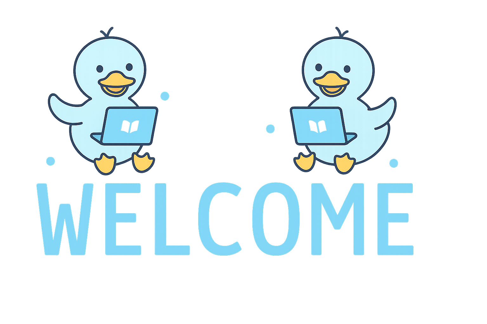

# Welcome

Selamat Datang di **Belajar Bahasa Jepang dengan metode Immersion**!

Hai! 👋  
Website ini dibuat khusus untuk kamu yang ingin belajar **bahasa Jepang** dengan cara yang lebih **alami, menyenangkan**, dan **efektif** — yaitu dengan **Metode Immersion**.

---

## 🎧 Apa itu Metode Immersion?

Metode Immersion adalah cara belajar bahasa dengan **mengkonsumsi konten berbahasa Jepang secara langsung**, melalui berbagai media seperti:

- Anime 🎥
- Manga 📚
- Drama 📺
- Visual Novel 🎮
- Podcast 🎧  
- Video YouTube 📱

Daripada menghafal dari textbook yang membosankan, kita akan **membiasakan otak kita dengan bahasa Jepang** seperti layaknya anak kecil belajar bahasa ibu mereka.

---

## 🐣 Cocok untuk Siapa?

Metode ini cocok untuk:
- Pemula yang ingin belajar dengan cara yang tidak membosankan
- Pelajar menengah yang merasa stuck dengan cara tradisional
- Siapa saja yang ingin bisa **mendengar dan membaca bahasa Jepang dengan natural**

---

## 📚 Apa yang Akan Kamu Temukan di Sini?

- Panduan langkah demi langkah untuk memulai immersion
- Rekomendasi konten Jepang sesuai level
- Tips belajar kanji, grammar, dan kosakata dari konten berbahasa Jepang
- Alat bantu seperti Anki, subtitle tools, dan lain-lain
- Artikel dan blog dari pengalaman pribadi belajar Jepang dengan immersion

---

## 🚀 Ayo Mulai!

Mulailah dari halaman [Panduan Awal](/guide/introduction.md) atau cek [Blog](/blog/) untuk inspirasi dan pengalaman belajar.

---

Selamat belajar dan selamat bersenang-senang!  
**じゃあ、いこうか！(Jaa, ikou ka!)** 🐥
